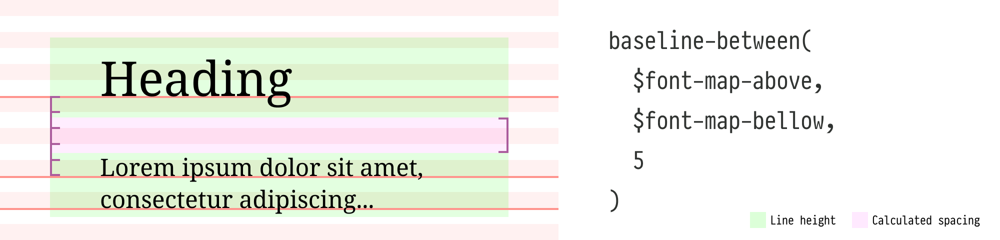

# rhythm-sass


rhythm-sass is a Sass library for implementing vertical rhythm in web typography, inspired by and building upon concepts introduced by [Plumber](https://jamonserrano.github.io/plumber-sass/). It calculates precise font offsets to align text with vertical rhythm grids, enabling front-end developers to achieve pixel-perfect control over typographic elements.

Before using rhythm-sass, it's important to understand the concept of the baseline ratio. This ratio determines how the text is vertically positioned within the allocated line-height. You can find baseline ratios for popular fonts on [Plumber's website](https://jamonserrano.github.io/plumber-sass/baselines/). For a deeper dive, check out [this detailed post](https://peiwen.lu/post/rhythm-sass).

## Installation

To install rhythm-sass using npm, execute the following command:

```
npm install --save-dev rhythm-sass
```

## Usage

```scss
// Option 1: Use directly in your stylesheet
@use "rhythm-sass" as * with (
  $baseline-ratio: 0.112061,   // required
  $rhythm-size: 8px,           // optional
  $rem-size: 16px              // optional
);

// Option 2: Forward with custom settings to be used in other files
@forward "rhythm-sass" with (
  $baseline-ratio: 0.112061,   // required
  $rhythm-size: 8px,           // optional
  $rem-size: 16px              // optional
);

// Set the primary font size and family
:root {
  font: 16px/1 "Noto Serif", serif;
}
```

This library exposes three global variables:

* `$baseline-ratio` specifies the baseline ratio for the primary font used in your design. For example, `0.112061` is the ratio of the Noto Serif font family.

* `$rhythm-size` specifies the base unit height for the vertical rhythm grid. The default value is `8px`.

* `$rem-size` specifies the reference value for calculating `rem` units. The default value is `16px`. Ignore this setting if you don't use the `rem` unit.

## The font-map

This library requires you to define your typography settings in Sass maps, referred to **font-maps**. Here's an example of a font-map definition:

```scss
$heading-font: (
  font-size: 32px,             // required
  line-height: 5,              // required
  font-family: "Roboto Mono",  // optional
  baseline-ratio: 0.158203     // optional
);
```

* `font-size` corresponds to the CSS `font-size` property. For optimal results, use the same unit as the global `$rhythm-size` variable. If different units are used, rhythm-sass can perform automatic conversion between `px` and `rem` for the `font-size` value.

* `line-height` corresponds to the CSS `line-height` property but with a specialized implementation. It accepts only integers, representing the number of rhythm grids. For example, `line-height: 5` equals `5` times the global `$rhythm-size` variable. _Using rhythms for `line-height` ensures proper vertical alignment across multiple lines._

* `baseline-ratio` overrides the global `$baseline-ratio` variable for a specific font. Use it when you have a secondary font in your design, allowing you to set a different baseline ratio than the primary font.

You can include additional CSS properties like `font-family` or `letter-spacing` in your font-map. These extra properties are specifically used with the `font` mixin (explained in a later section). However, do not include `padding` and `margin`, as these will be separately calculated by the rhythm-sass functions to determine precise offsets, ensuring text baselines align perfectly with the vertical rhythm grid.

Create a font-map for each type of text, such as headings, subheadings, paragraphs, or code, to keep your typography styles organized and reusable.

## Functions

Functions use the `font-size`, `line-height`, and (if present) `baseline-ratio` values from the provided font-map for calculations, producing results in the global `$rhythm-size` unit.

### `rhythm($rhythms, $offset: 0)`


The `rhythm()` function calculates the total height of a specified number of rhythm grids. It accepts two arguments:
 
 - `$rhythms`: The number of rhythm grids
 - `$offset` (optional): Adjusts the calculated result for additional sizing factors, such as border width.

For example, if you want to add a top padding of `5` rhythm grids to an element with a `1px` top border, the actual `padding-top` should be `39px` instead of `40px` (assuming an 8px rhythm). You can calculate the correct padding using a `-1px` offset parameter:

``` scss
padding-top: rhythm(5, -1px);
```

The offset unit is automatically handled by the function. If different units are used, the function will output the result in the `calc()` format.

### `baseline-top($font-map, $rhythms, $offset: 0)` <br/> `rhythm-bottom($font-map, $rhythms, $offset: 0)`


The `baseline-top()` function calculates the spacing from the top of the font's line-height to the top of the nth rhythm grid **above** the baseline. It accepts:

- `$font-map`: The current font map.
- `$rhythms`: The number of rhythm grids between the baseline and the target rhythm grid above it.
- `$offset` (optional): Adjusts the calculated spacing.

`rhythm-bottom()` is an alias for `baseline-top()`, providing a more intuitive naming option. It calculates the spacing from the top of the nth rhythm grid above the baseline to the top of the font's line-height.

### `baseline-bottom($font-map, $rhythms, $offset: 0)` <br/> `rhythm-top($font-map, $rhythms, $offset: 0)`


The `baseline-bottom()` function calculates the spacing from the bottom of the font's line-height to the bottom of the nth rhythm grid **below** the baseline. It accepts:

- `$font-map`: The current font map.
- `$rhythms`: The number of rhythm grids between the baseline and the target rhythm grid below it.
- `$offset` (optional): Adjusts the calculated spacing.

`rhythm-top()` is an alias for `baseline-bottom()`, providing a more intuitive naming option. It calculates the spacing from the bottom of the nth rhythm grid below baseline to the bottom of the font's line-height.

### `baseline-between($font-map-above, $font-map-below, $rhythms, $offset: 0)`



The `baseline-between()` function calculates the spacing between two fonts, from the bottom of the above font's line-height to the top of the below font's line-height. It accepts:

- `$font-map-above`: The font map of the above element.
- `$font-map-below`: The font map of the below element.
- `$rhythms`: The number of rhythm grids between adjacent text baselines.
- `$offset` (optional): Adjusts the calculated spacing.

## Mixins

### `font($font-map, $spacing-map)`

The `font` mixin efficiently generates font-related CSS properties and calculates spacings. It translates all `$font-map` keys into corresponding CSS properties, except for `baseline-ratio`, facilitating easy style reuse. It also simplifies calling rhythm functions for calculations.

The `$spacing-map` accepts four keys, each corresponding to a CSS property:

- `margin-top`
- `margin-bottom`
- `padding-top`
- `padding-bottom`

These keys use a special syntax to call rhythm functions. Here's how it works:

1. The value for each key is a Sass list.
2. The first item in the list is the function name.
3. The remaining items are the function arguments.
4. The current `$font-map` is automatically used and should be omitted from the arguments.
5. When calling the `baseline-between` function:
   - For `padding-top` and `margin-top`, the current `$font-map` is treated as `$font-map-below`.
   - For `padding-bottom` and `margin-bottom`, the current `$font-map` is treated as `$font-map-above` .

Example usage:

```scss
$paragraph-font-map: (
  font-size: 20px,
  line-height: 4,
);

$quote-font-map: (
  font-size: 18px,
  line-height: 3,
  font-style: italic
);

.quote {
  @include font($quote-font-map, (
    margin-top: baseline-between $paragraph-font-map 3,
    padding-bottom: baseline-bottom 3
  ));
}
```

In this example:

- `margin-top` value is translated to `baseline-between($paragraph-font-map, $quote-font-map, 3)`.
- `padding-bottom` value is translated to `baseline-bottom($quote-font-map, 3)`.

For more examples, please refer to the [examples](./examples) folder in the project root.

### `draw-rhythms($color: rgb(255 120 120 / 25%))`

When fine-tuning your typography, visualizing the vertical rhythm grids can be incredibly helpful in ensuring consistency and identifying any alignment issues. The `draw-rhythms()` mixin is a handy tool for visualizing these grids. It reads your global settings and draws the vertical rhythm grids on the `:root` element, making it easy to see how your typography aligns with the overall rhythm.

```scss
// Include this mixin at the top level of your SCSS file.

@if not production {
  @include draw-rhythms;
  // or with a custom color
  @include draw-rhythms(rgb(0 255 255 / 25%));
}
```

Note: Enabling this mixin will set the `position` property of your `:root` element to `relative`. If you have already set your `:root` element to a different positioning value (e.g., `absolute` or `fixed`), using this mixin may affect your existing layout. In such cases, you may need to adjust your `:root` element's positioning or find an alternative way to visualize the rhythm grids.

## Pro Tip

For complex layouts, it's recommended to ensure that all text elements, such as headings, paragraphs, and lists, occupy a whole number of rhythm grids. This means aligning the top and bottom of each element precisely with the vertical rhythm grid lines. By doing this, each text element will neatly fit into the overall rhythm of the layout, making it much easier to combine and arrange elements harmoniously.

## Credits

This project is inspired by [Plumber](https://jamonserrano.github.io/plumber-sass/).
